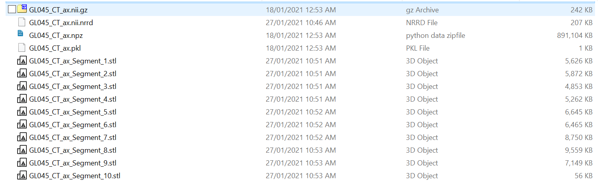
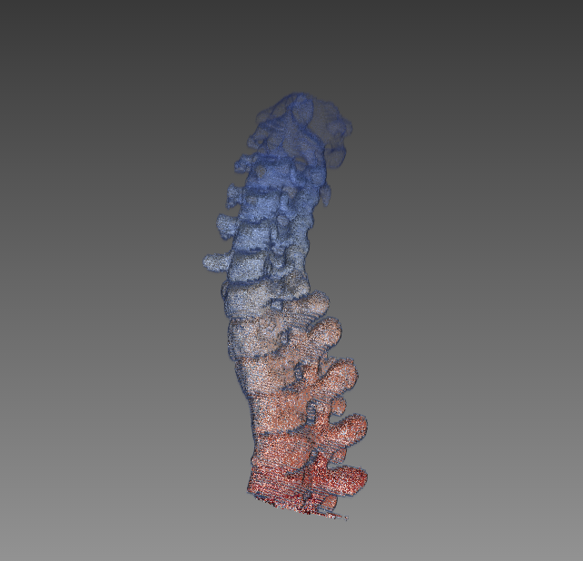
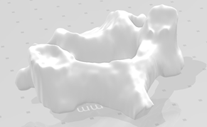
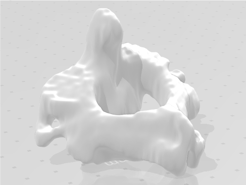
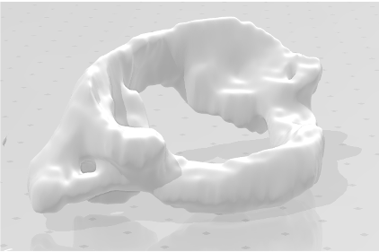
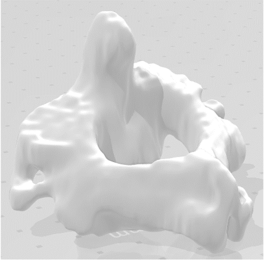

# Multilabel Niftis2Stl
Simple python code to transfer one segmented nii.gz file to a list of stl files based on the labels

The segmented nii.gz file contains series of identical labels, such as 1,2,4,5. Then the code could transfer this single nii.gz file into series of .stl file using simpleITK and vtk to create the mesh. 



This code can be used in many medical imaging situations as a final step of processing output that be read by clients.
Labels do not require to be continuous, but need to be numbers (int, float...)

#### Sample Input file (.Dicom)


#### Sample Output .STL Files

<table>
  <tr>
    <td>T7</td>
     <td>T10</td>
     <td>L5</td>
  </tr>
  <tr>
    <td></td>
    <td></td>
    <td></td>
  </tr>
 </table>


#### Auto smooth
It will also smooth the surface (parameters can be changed) for the outputs

<table>
  <tr>
    <td>No smooth</td>
     <td>Smoothed</td>
  </tr>
  <tr>
    <td></td>
    <td></td>
  </tr>
 </table>

### Usage
```ruby
cd YOUR_RESULT_FOLDER
python nii_2_mesh_v3.py
```
